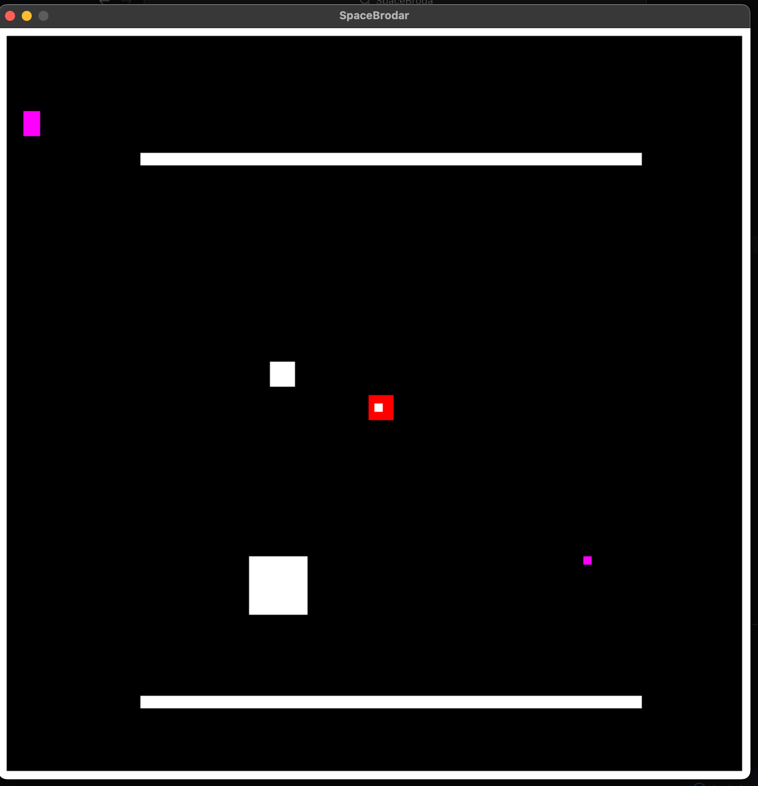

# SpaceBroda

## this is a simple game made with:

### Pygame

### random

### math

is this project I learned how to implement classes in the right way, make some 3D interations and implement sound.

